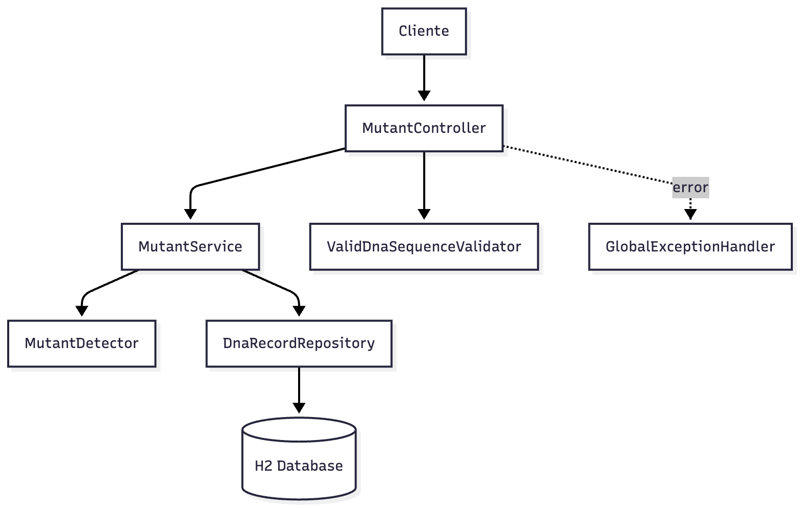
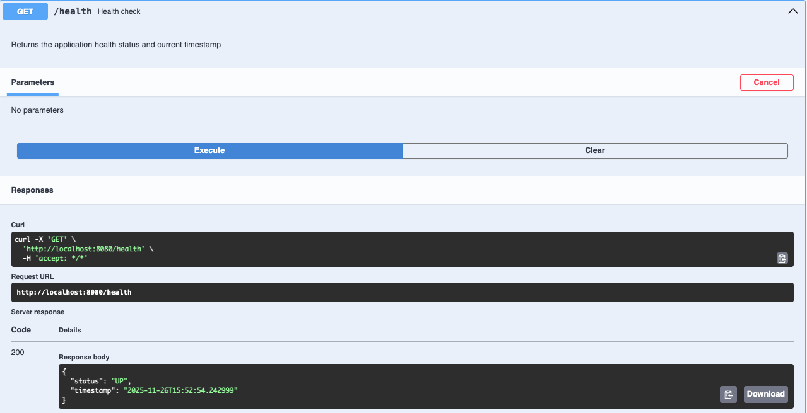
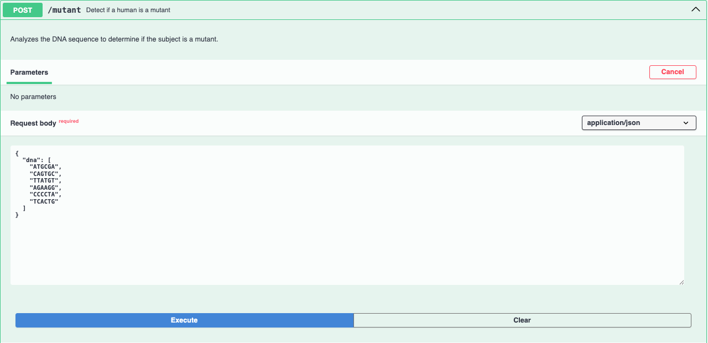
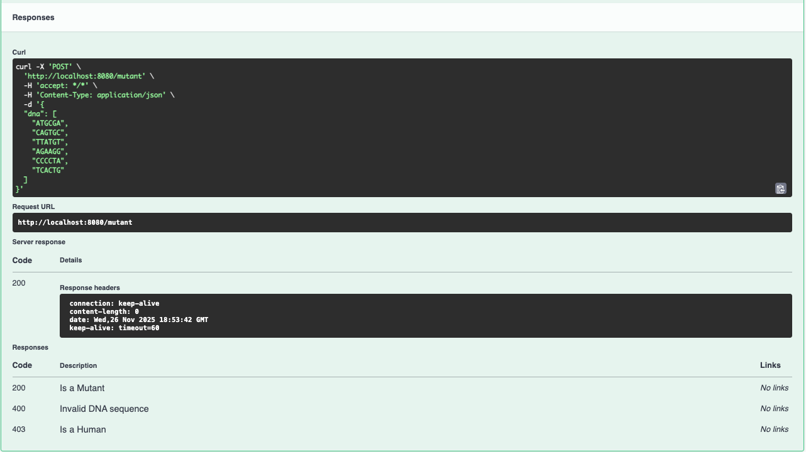
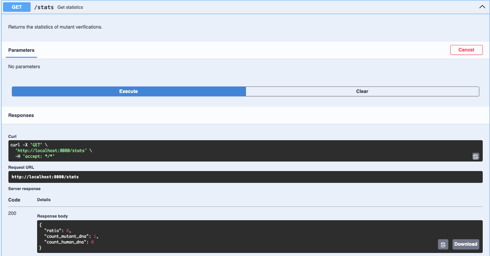
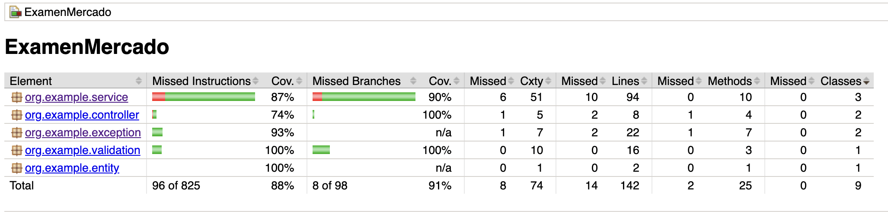
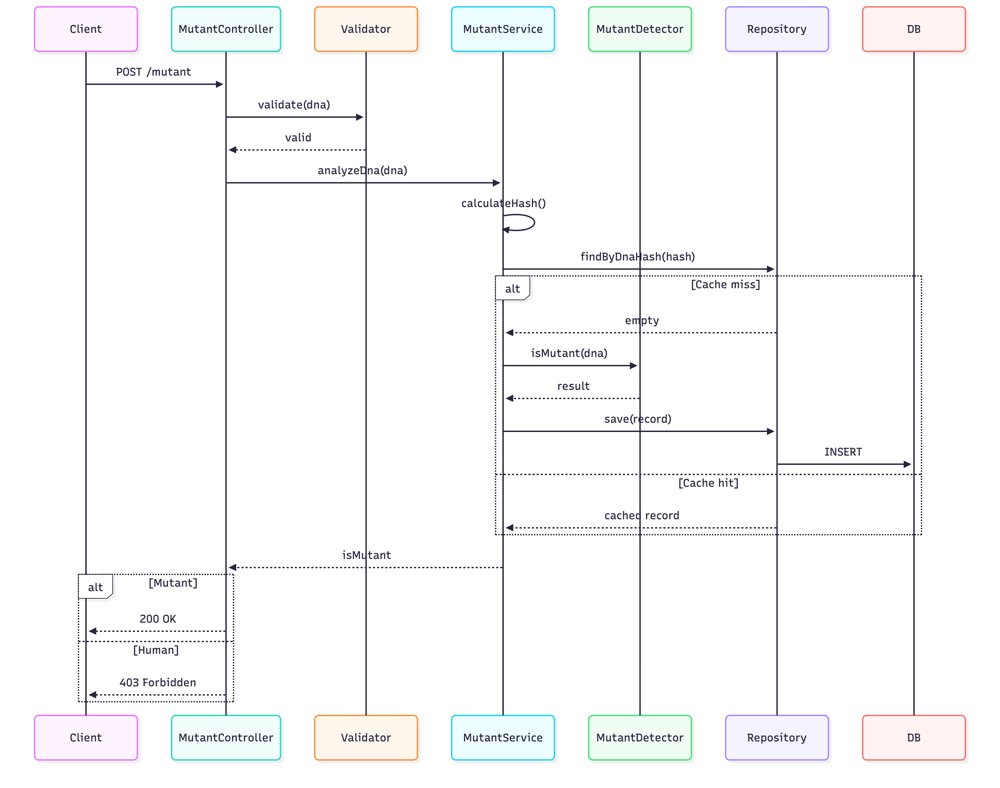

# Mutant Detector API

---

## Descripción del proyecto
API REST desarrollada en Spring Boot para detectar mutantes basándose en el análisis de secuencias de ADN. La detección se realiza mediante el escaneo de patrones específicos en matrices NxN que representan cadenas genéticas. Un humano es considerado mutante si su ADN contiene más de una secuencia de cuatro letras iguales (A, T, C, G) orientadas horizontal, vertical o diagonalmente. El proyecto implementa una arquitectura en capas con Spring Data JPA, validaciones Bean Validation y custom, manejo centralizado de excepciones, y documentación OpenAPI completa.

---

## Tecnologías:


---

## Arquitectura

El proyecto sigue una arquitectura en capas con responsabilidades claramente separadas:

- **Controller**: Manejo de requests HTTP y routing (`MutantController`, `HealthController`)
- **Service**: Lógica de negocio y orquestación (`MutantService`, `StatsService`)
- **Detector**: Algoritmo core de detección (`MutantDetector`)
- **Validator**: Validaciones custom de Bean Validation (`ValidDnaSequenceValidator`)
- **Repository**: Acceso a datos con Spring Data JPA (`DnaRecordRepository`)
- **Entity**: Modelo de persistencia JPA (`DnaRecord`)
- **Exception**: Manejo centralizado de errores (`GlobalExceptionHandler`)
- **Config**: Configuración de Swagger y caché



---

## Estructura del proyecto
```
src/main/java/org/example/
│
├── 📁 controller/          # Capa de Presentación
│   ├── MutantController.java
│   └── HealthController.java
│
├── 📁 dto/                 # Capa de Transferencia de Datos
│   ├── DnaRequest.java
│   ├── StatsResponse.java
│   └── ErrorResponse.java
│
├── 📁 service/             # Capa de Lógica de Negocio
│   ├── MutantDetector.java
│   ├── MutantService.java
│   └── StatsService.java
│
├── 📁 repository/          # Capa de Acceso a Datos
│   └── DnaRecordRepository.java
│
├── 📁 entity/              # Capa de Modelo de Datos
│   └── DnaRecord.java
│
├── 📁 config/              # Capa de Configuración
│   ├── SwaggerConfig.java
│   └── CacheConfig.java
│
├── 📁 validation/          # Validaciones Custom
│   ├── ValidDnaSequence.java
│   └── ValidDnaSequenceValidator.java
│
├── 📁 exception/           # Manejo de Excepciones
│   ├── GlobalExceptionHandler.java
│   └── DnaHashCalculationException.java
│
└── MutantDetectorApplication.java  # Main

src/test/java/org/example/
│
├── 📁 controller/
│   ├── MutantControllerTest.java
│   └── HealthControllerTest.java
│
├── 📁 service/
│   ├── MutantDetectorTest.java
│   ├── MutantServiceTest.java
│   └── StatsServiceTest.java
│
├── 📁 exception/
│   └── GlobalExceptionHandlerTest.java
│
└── 📁 validation/
    └── ValidDnaSequenceValidatorTest.java
```
---

## Algoritmo de Detección

El detector analiza la matriz de ADN en un solo paso (single pass) buscando secuencias de cuatro caracteres iguales consecutivos en cuatro direcciones: horizontal (→), vertical (↓), diagonal descendente (↘) y diagonal ascendente (↗). La implementación incluye **early termination**, deteniendo la búsqueda inmediatamente al encontrar dos secuencias, lo que optimiza el rendimiento significativamente en casos de ADN mutante.

La complejidad temporal es O(N²) en el peor caso, pero con early termination se reduce a ~O(N) en la práctica. La complejidad espacial es O(1), utilizando solo un contador sin estructuras auxiliares. El algoritmo realiza boundary checking antes de cada búsqueda y comparaciones directas sin loops adicionales para máxima eficiencia.

---

## Validaciones

El sistema implementa múltiples niveles de validación:

- **Matriz NxN**: Debe ser cuadrada (igual número de filas y columnas)
- **Tamaño**: Mínimo 4x4, máximo 1000x1000
- **Caracteres**: Solo A, T, C, G (mayúsculas o minúsculas, se normalizan automáticamente)
- **Integridad**: No se permiten arrays nulos, vacíos o con filas nulas
- Cualquier validación fallida retorna **400 Bad Request** con mensaje descriptivo

---

## Persistencia

La estrategia de almacenamiento utiliza **deduplicación por hash SHA-256** para evitar duplicados. Cada secuencia de ADN se hashea antes de consultar la base de datos. Si el hash ya existe, se retorna el resultado cacheado sin reanalizar. Si no existe, se ejecuta el algoritmo, se almacena el resultado y se persiste en H2.

**Entidad DnaRecord:**
- `id`: Primary key (auto-increment)
- `dnaHash`: SHA-256 único (constraint UNIQUE)
- `isMutant`: Resultado del análisis (boolean)
- `createdAt`: Timestamp de creación

El repository implementa `findByDnaHash()` para búsqueda O(1) y `countByIsMutant()` para estadísticas.

---

## Endpoints

### POST /mutant
Analiza una secuencia de ADN y determina si es mutante.

**Request:**
```json
{
  "dna": ["ATGCGA", "CAGTGC", "TTATGT", "AGAAGG", "CCCCTA", "TCACTG"]
}
```

**Responses:**
- `200 OK` - Es mutante
- `403 Forbidden` - Es humano
- `400 Bad Request` - DNA inválido

### GET /stats
Retorna estadísticas de verificaciones realizadas.

**Response:**
```json
{
  "count_mutant_dna": 40,
  "count_human_dna": 100,
  "ratio": 0.4
}
```

### GET /health
Health check del servicio.

**Response:**
```json
{
  "status": "UP",
  "timestamp": "2024-01-15T10:30:00"
}
```

---

## Swagger

Documentación interactiva disponible en `/swagger-ui.html`. La API incluye anotaciones completas `@Tag`, `@Operation`, `@ApiResponse` en controllers y `@Schema` en DTOs para documentación exhaustiva.









---

# ✅ Tests & Coverage

El proyecto incluye **59 tests automáticos** entre unitarios e integración, cumpliendo al **100% los requisitos establecidos** en la documentación provista por la cátedra (*documentacionTest.md* y *Guía de Evaluación*).

---

## ✔️ Resumen de Cantidad de Tests

| Componente                         | Tests Requeridos | Tests Implementados | Estado            |
|-----------------------------------|------------------|----------------------|-------------------|
| **MutantDetectorTest**            | 16               | **17**               | ✔️ (+1 extra)     |
| **MutantServiceTest**             | 5                | **5**                | ✔️                |
| **StatsServiceTest**              | 6                | **6**                | ✔️                |
| **MutantControllerTest**          | 8                | **9**                | ✔️ (+1 extra)     |
| **ValidDnaSequenceValidatorTest** | No requerido     | **13**               | ✔️ Extra          |
| **GlobalExceptionHandlerTest**    | No requerido     | **5**                | ✔️ Extra          |
| **HealthControllerTest**          | No requerido     | **4**                | ✔️ Extra          |
| **TOTAL**                         | **35 requeridos** | **59 implementados** | ✔️ **168%** del mínimo |

---

# 📈 Cobertura Jacoco

El reporte Jacoco generado muestra:



**Cumple ampliamente** con el requisito mínimo de **≥ 85%**.  
Las clases sin lógica (DTOs, Config, Repository) no bajan la cobertura total.

**Reporte completo:**  
`build/reports/jacoco/test/html/index.html`

---

# Tipos de Pruebas Cubiertas

## ✔️ MutantDetector (núcleo del algoritmo)

- Secuencias horizontales, verticales, diagonales ↘ y ↗  
- Matrices 4x4, 6x6, 10x10  
- Matrices no cuadradas  
- Caracteres inválidos  
- Fila nula  
- *Early termination*  
- Caso borde: todas las letras iguales  
- Matrices pequeñas (<4)  

---

## ✔️ MutantService

- Hash **SHA-256** consistente  
- Detección de mutante/humano  
- Cache & deduplicación (**no reanaliza ADN repetido**)  
- Persistencia en base de datos  
- Verificación de llamadas a `findByDnaHash()` y `save()`  

---

## ✔️ StatsService

- Cálculo de **mutants**, **humans** y **ratio**  
- Casos especiales analizados:
  - humanos = 0  
  - mutantes = 0  
  - base de datos vacía  

---

## ✔️ Controllers (MockMvc – Tests de integración)

- `POST /mutant` → **200 OK**  
- `POST /mutant` → **403 Forbidden**  
- `POST /mutant` → **400 Bad Request**  
- `GET /stats` → **200 OK**  
- Validación completa del RequestBody  
- Endpoint de salud `GET /health`  

---

## ✔️ Validación y Excepciones

- **18 tests extra** cubriendo todas las reglas del validador  
- `GlobalExceptionHandler` con **100% de cobertura**  
- ValidDnaSequenceValidator completamente testeado

---

## Diagrama de Secuencia



---

## Ejecución Local

```bash
./gradlew bootRun
```

Swagger UI: `http://localhost:8080/swagger-ui.html`

---

## Deploy en Render

**Build command:**
```bash
./gradlew clean build -x test
```

**Start command:**
```bash
java -jar build/libs/*.jar
```

---

## 📚 Autor

**Autor:** Luciano Paulucci  
**Legajo:** 49089  
**Curso:** 3K9 – Desarrollo de Software  

